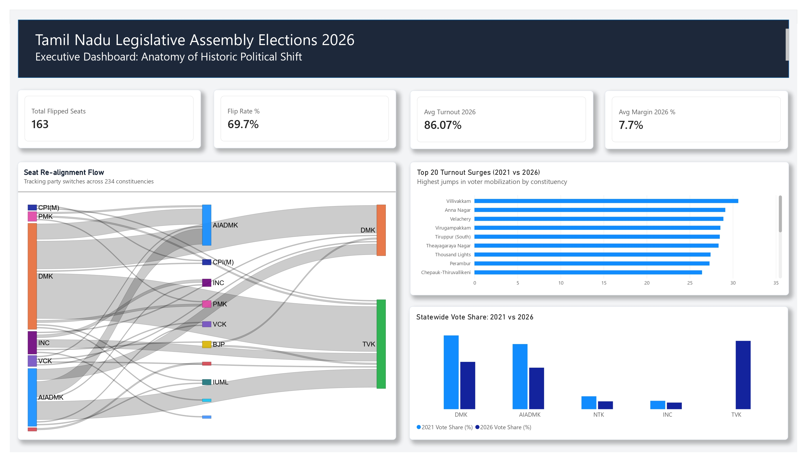
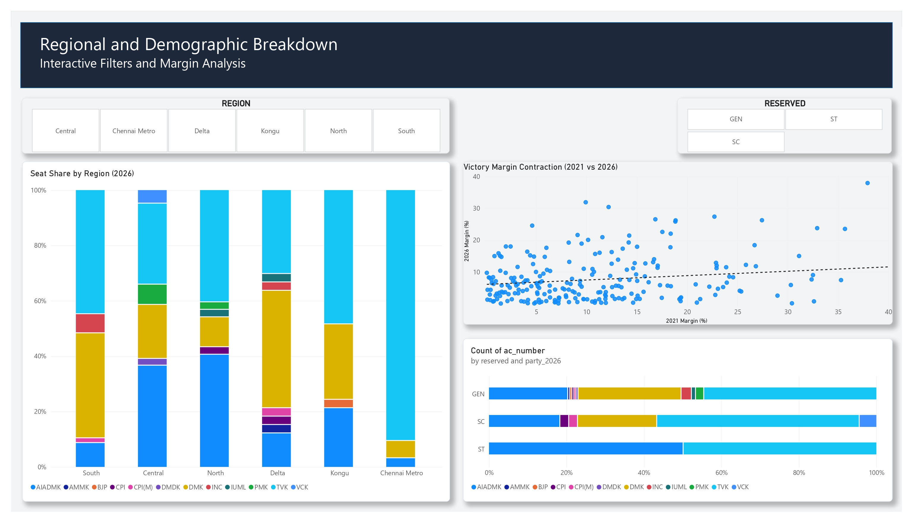

# 🗳️ Tamil Nadu Legislative Assembly Election 2026: Anatomy of a Political Disruption

[]()
[]()
[]()

## 📌 Project Overview
This end-to-end data analytics project examines the 2026 Tamil Nadu Legislative Assembly Election, a watershed moment characterized by record-breaking voter mobilization and massive electoral realignment. 

The objective of this project is to transform granular, raw candidate-level election data across all 234 Assembly Constituencies (ACs) into a structured, executive-ready interactive dashboard. By focusing on data storytelling, this analysis unpacks the mechanics of a political disruption—specifically how a surge in urban voter turnout fueled unprecedented geographic shifts, widespread seat flips, and highly fractured victory margins.

---

## 📸 Dashboard Previews

### Page 1: Executive Summary & Realignment Flow


### Page 2: Regional & Demographic Fractures


---

## 🛠️ Tech Stack & Architecture
- **Data Wrangling:** Python, Pandas, NumPy, Jupyter Notebooks
- **Data Visualization & BI:** Microsoft Power BI
- **Data Modeling:** Star Schema (1-to-1 matching), DAX (Data Analysis Expressions)

---

## ⚙️ Methodology & Pipeline

### Phase 1: Data Ingestion & Transformation (Python)
The raw data consisted of unformatted candidate results from both the 2021 and 2026 state elections. 
* **Standardization:** Merged multiple datasets using the official Election Commission `ac_number` as the primary key to resolve spelling discrepancies (e.g., *Gummidipoondi* vs. *Gummidipundi*).
* **Feature Engineering:** 
  * Calculated the absolute winner and runner-up for every constituency using Pandas `groupby()` and sorting logic.
  * Computed exact victory margins (`margin_pct`) and absolute vote share captured by each party.
  * Derived year-over-year turnout differentials to isolate regions with irregular voter mobilization.
* **Extraction:** Generated four structured, clean tables optimized for a relational database (`powerbi_seat_flips.csv`, `powerbi_turnout.csv`, `powerbi_vote_shares.csv`, `powerbi_margins.csv`).

### Phase 2: Relational Modeling & DAX (Power BI)
* Imported the structured CSVs into Power BI to construct a cohesive relational model.
* Engineered a dedicated `_Measures` table using **DAX** to calculate dynamic KPIs, such as average turnout (filtered for nulls), margin compression rates, and absolute seat flip totals.
* Verified calculation integrity (e.g., ensuring percentage aggregates did not implicitly multiply by 100).

### Phase 3: UX/UI & Data Storytelling
Designed a cognitive-load-friendly interface adopting modern application aesthetics:
* **Custom Visuals:** Implemented a Sankey Diagram to map the exact flow of constituency shifts from 2021 winners to 2026 winners, replacing traditional dense cross-tabulations.
* **Color Psychology:** Hard-coded a consistent, universally recognizable color palette for distinct political entities across all visuals to eliminate legend dependency.
* **Interactive Navigation:** Replaced standard dropdowns with modern UI "pill" slicers for instant regional and demographic cross-filtering.

---

## 📊 Core Business Insights & Discoveries

The dashboard was built to answer six targeted analytical questions. The data revealed the following narrative:

1. **The Disruption (Massive Seat Turnover)**
   An unprecedented **163 out of 234 seats (69.7%) flipped** to a new winning party compared to the 2021 election cycle. The Sankey flow diagram maps how the traditional duopoly's base fractured to facilitate this shift.

2. **The Turnout Surge (Urban Mobilization)**
   The state witnessed a record-breaking **average voter turnout of 86.1%** (up from 73.4% in 2021). The Top 20 constituencies with the highest turnout surges were heavily concentrated in urban centers, with **16 of the top 20 located in the Chennai Metro region**.

3. **Geographic Realignment**
   The new political challenger (TVK) completely swept the 29 seats in the Chennai Metro region and severely fractured traditional stronghold belts in the Kongu (West) and South regions, fundamentally altering the state's electoral map.

4. **Vote Share Displacement**
   TVK captured **34.9% of the statewide vote share**, directly compressing the traditional major parties, with DMK losing roughly 13% and AIADMK losing 12% of their previous vote bases.

5. **Reserved Constituency Performance**
   Out of the 46 reserved constituencies, TVK captured **over 52% of the Scheduled Caste (SC) seats** (23 out of 44), proving that their electoral performance was actually stronger in reserved demographics than in general (GEN) constituencies.

6. **Victory Margin Compression**
   Due to multi-cornered contests, the statewide average victory margin **shrank drastically from 11.7% to just 7.7%**. The scatter plot visualizes this downward shift, revealing that **64 seats were won with less than 35% of the total vote** (a massive jump from only 2 such seats in 2021).

---

## 📁 Repository Structure
```text
TN_Election_2026_Analysis/
├── data/                       
│   ├── raw/                    # Original unformatted datasets
│   └── processed/              # Python-cleaned CSVs for Power BI
├── notebooks/                  
│   └── 01_election_data_prep.ipynb  # Data wrangling logic
├── powerbi/                    
│   └── TN_Election_Dashboard.pbix   # Final interactive dashboard
├── images/                     
│   ├── dashboard_page1.png     
│   └── dashboard_page2.png     
└── README.md
